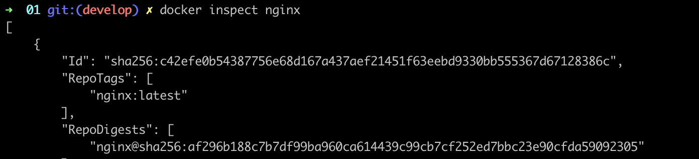

# Simple Docker

Introduction to docker. Developing a simple docker image for your own server.

1. [Ready-made docker](#part-1-ready-made-docker) 
2. [Operations with container](#part-2-operations-with-container) 
3. [Mini web server](#part-3-mini-web-server) 
4. [Your own docker](#part-4-your-own-docker) 
5. [Dockle](#part-5-dockle) 
6. [Basic Docker Compose](#part-6-basic-docker-compose)

# 

## Part 1. Ready-made docker

##### Take the official docker image from **nginx** and download it using `docker pull`.

##### Check for the docker image with `docker images`

##### Run docker image with `docker run -d [image_id|repository]`

##### Check that the image is running with `docker ps`

##### View container information with `docker inspect [container_id|container_name]`

[docker_inspect_id.json](01/docker_inspect_id.json) \
[docker_inspect_id.json](01/docker_inspect_nginx.json)

##### From the command output define and write in the report the container size, list of mapped ports and container ip

##### Stop docker image with `docker stop [container_id|container_name]`

##### Check that the image has stopped with `docker ps`

##### Run docker with mapped ports 80 and 443 on the local machine with *run* command

##### Check that the **nginx** start page is available in the browser at *localhost:80*

##### Restart docker container with `docker restart [container_id|container_name]`

##### Check in any way that the container is running

#

## Part 2. Operations with container

##### Read the *nginx.conf* configuration file inside the docker container with the *exec* command

##### Create a *nginx.conf* file on a local machine

##### Configure it on the */status* path to return the **nginx** server status page

##### Copy the created *nginx.conf* file inside the docker image using the `docker cp` command

##### Restart **nginx** inside the docker image with *exec*

##### Check that *localhost:80/status* returns the **nginx** server status page

##### Export the container to a *container.tar* file with the *export* command

##### Stop the container

##### Delete the image with `docker rmi [image_id|repository]`without removing the container first

##### Delete stopped container

##### Import the container back using the *import*command

##### Run the imported container

##### Check that *localhost:80/status* returns the **nginx** server status page

#

## Part 3. Mini web server

##### Write a mini server in **C** and **FastCgi** that will return a simple page saying `Hello World!`

##### Run the written mini server via *spawn-fcgi* on port 8080

##### Write your own *nginx.conf* that will proxy all requests from port 81 to *127.0.0.1:8080*

##### Check that browser on *localhost:81* returns the page you wrote

#

## Part 4. Your own docker

#### Write your own docker image that:
##### 1) builds mini server sources on FastCgi from [Part 3](#part-3-mini- web-server)
##### 2) runs it on port 8080
##### 3) copies inside the image written *./nginx/nginx.conf*
##### 4) runs **nginx**.

##### Build the written docker image with `docker build`, specifying the name and tag

##### Check with `docker images` that everything is built correctly

##### Run the built docker image by mapping port 81 to 80 on the local machine and mapping the *./nginx* folder inside the container to the address where the **nginx** configuration files are located (see [Part 2](#part-2-operations-with-container))

##### Check that the page of the written mini server is available on localhost:80

##### Add proxying of */status* page in *./nginx/nginx.conf* to return the **nginx** Яserver status

##### Restart docker image
*If everything is done correctly, after saving the file and restarting the container, the configuration file inside the docker image should update itself without any extra steps

##### Check that *localhost:80/status* now returns a page with **nginx** status
